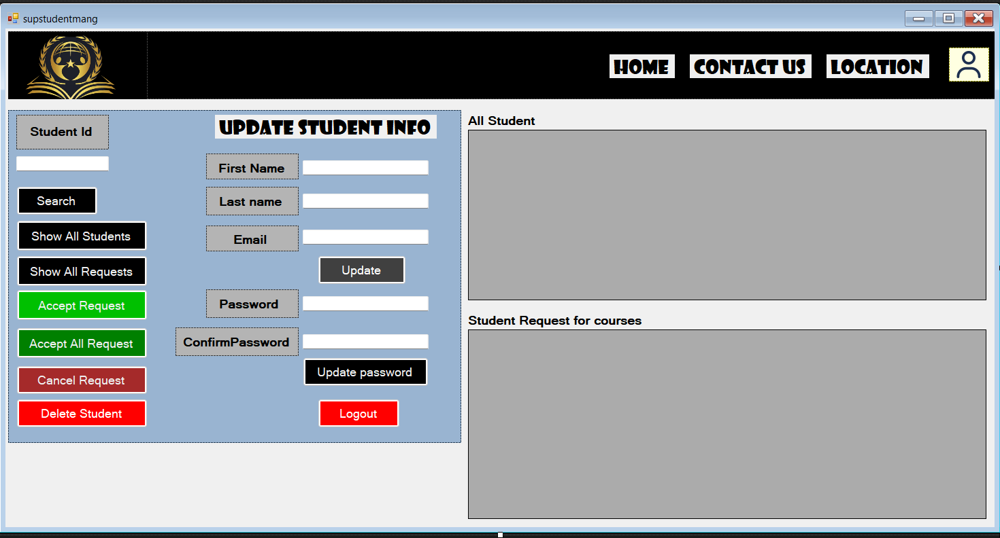

# Course Management System

## Project Description

This project is a Course Management System developed using C# Windows Forms.

The system allows students to register and log in, view available courses, enroll in courses, and manage their profile. Administrators can manage courses and student information according to their roles.

## Features

* User Registration
* User Login
* Role-based access
* Student course viewing
* Course enrollment
* Student profile management
* Course management
* Student management
* User Logout
* SQL Server database connection

## Technologies Used

* C#
* Windows Forms
* SQL Server
* .NET
* ADO.NET
* Visual Studio
* GitHub

## Database

The project uses SQL Server as the database.

The database contains tables for storing user and course information.

The database connection is configured through the constring in every file.

## How to Run

1. Open the project in Visual Studio.
2. Create the required database and tables in SQL Server.
3. Update the SQL Server connection string in every file. (data source name is change in your device)
4. Build the project.
5. Run the project.

My Role
Group Leader
Project Executor
Facilitator
Database Schema Designer
Coder
Team Player

## Project Report

The complete project report containing screenshots, diagrams, database design, and project information is included in this repository.

## Author

Udipto Kumar Bhowmik

## System Flow daigram

## System Screenshots

### Login

### Signup

### Admin

### Superadmin

